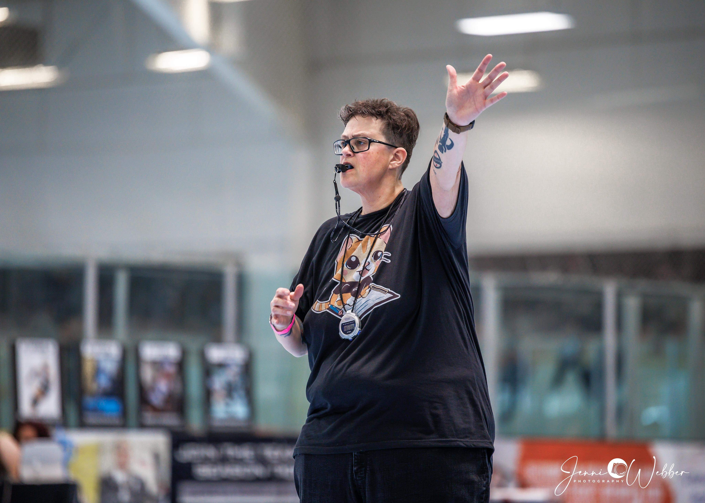

# Origin: The "Mas Wild" Identity

## From the Track to the Dashboard
The name **Mas Wild Labs** is born from the high-octane environment of flat-track roller derby. For 16 seasons, I have served as a **Non-Skating Official (NSO)** for both junior and adult leagues. 

## The Naming Tradition
In the world of roller derby, your "Derby Name" is a badge of honor that is rarely self-appointed. Most of the time, your name is given to you by the community. My name, **Mas Wild**, was given to me by a friend—a play on my last name, **Wilder**. No, I am not really "more wild", but people seem to think so!

## Performance Milestones

* **300+ Games Officiated:** Earning the "300 Games Cape" is a testament to long-term operational reliability and commitment to the sport. 
* **NSO of the Year Nomination:** A peer-driven nomination recognizing excellence in rules application, tournament leadership, and administrative accuracy.

## Precision Under Pressure
In roller derby, the NSOs are the "Engine Room" of the game. My tenure as an official taught me that systems only work if the documentation and the people running them are in total alignment. 

This "officiating mindset" is what I bring to technical operations:
1. **Neutrality:** Evaluating infrastructure based on data and efficiency rather than bias.
2. **Speed:** Solving bottlenecks before they impact the "game" (production).
3. **Clarity:** Communicating complex technical rules to diverse stakeholders to ensure system integrity.

## Current Service
I continue to volunteer my time to support the growth of the sport, ensuring that both local adult leagues and the next generation of junior skaters have the structured, fair, and logically-sound environment they need to compete.

> "In derby, if the NSOs are doing their job perfectly, you barely notice we're there. Technical operations is exactly the same."