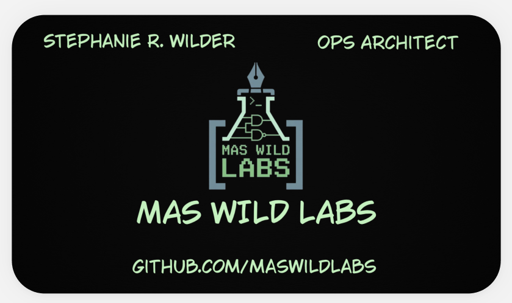

# Module 3: Professional Identity & Rationale

## The Rationale Behind Mas Wild Labs
The business name "Mas Wild Labs" is an intentional choice rooted in my identity within the roller derby community, where I have served as a Non-Skating Official (NSO) for 16 seasons. By carrying my nickname into my business name, I am leveraging my experience in officiating—a role that requires extreme precision, rule enforcement, and logic.

* **Tech-Noir Perspective:** The black/green terminal palette and circuit-pen hybrid logo evoke enterprise monitoring dashboards.
* **Ops Architect Persona:** This title reflects a career shift toward high-level workflow design and structural systems engineering.
* **Proven Logic:** I adopted a "checklist" aesthetic using square brackets `[X]` for core competencies to mirror a system status report.

---
## Business Card Design

---
## Design Rationale
The Mas Wild Labs identity bridges the gap between technical complexity and user-facing documentation.

* **The Palette:** I chose a black/green terminal palette to evoke the "tech-noir" precision of enterprise monitoring dashboards and my history in roller derby officiating.
* **Visual Standards:** I utilized high-contrast digital aesthetics to apply the **Contrast** principle from CRAP standards, ensuring critical technical information stands out.
* **The Iconography:** The hybrid logo represents the intersection of technical engineering (the circuit) and technical writing (the pen).